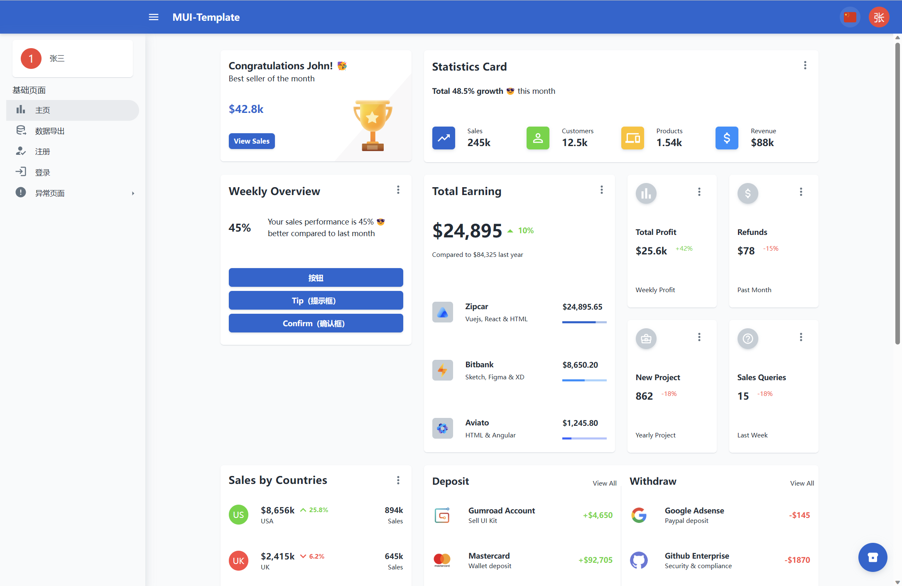
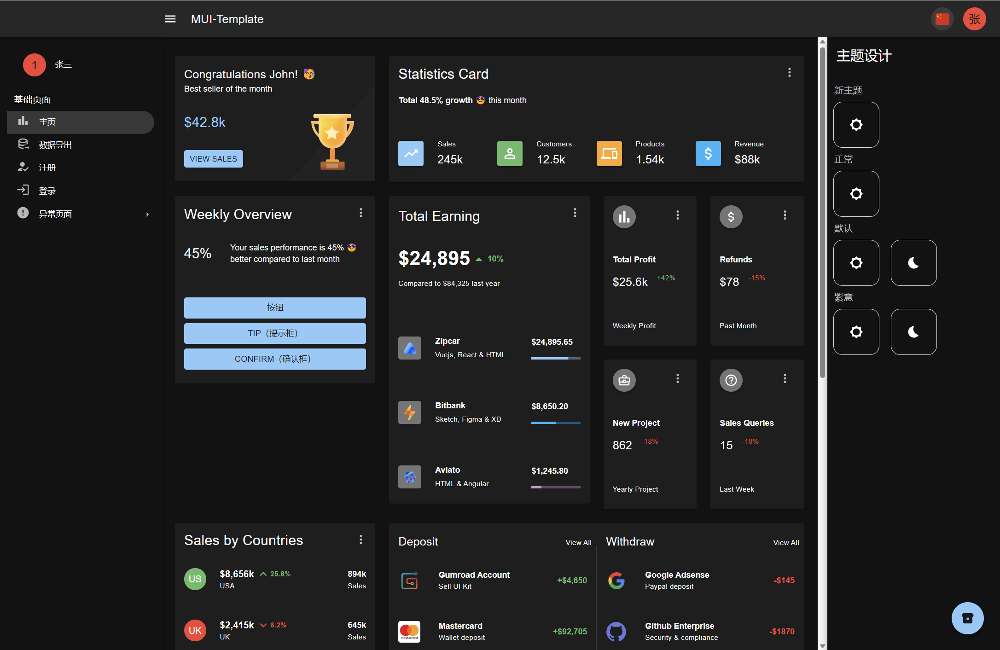
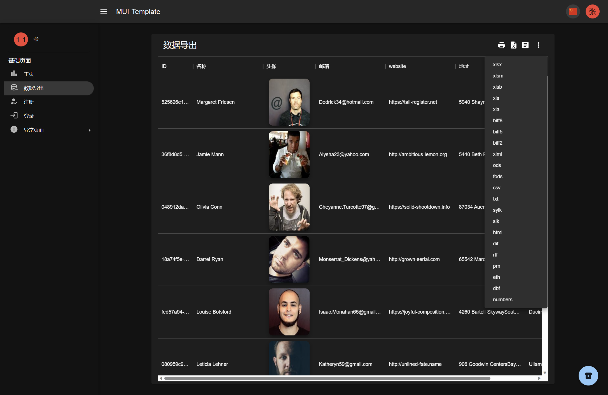
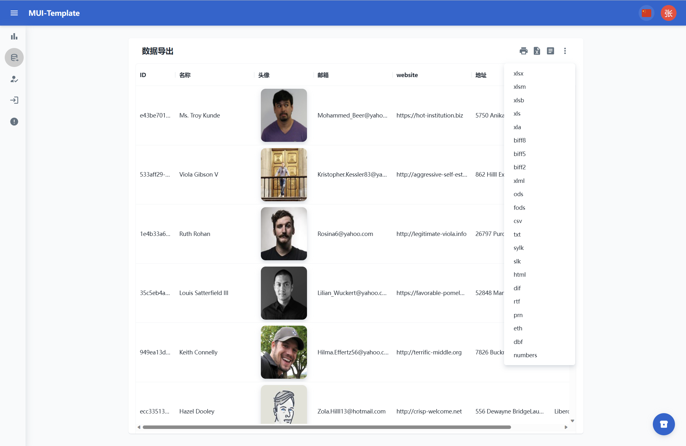
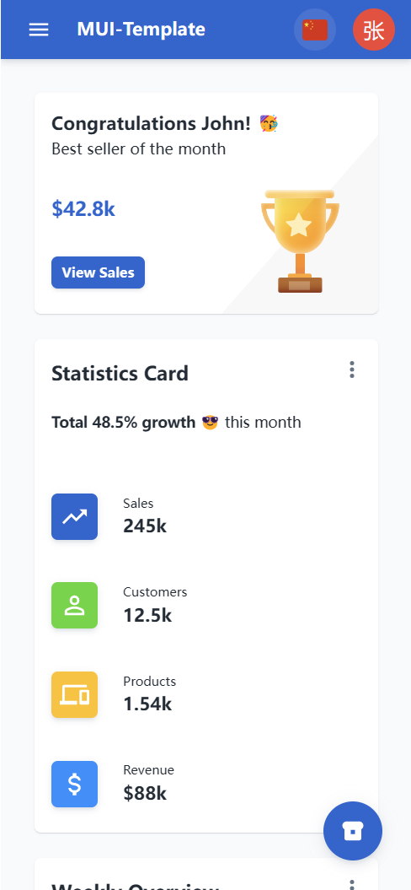
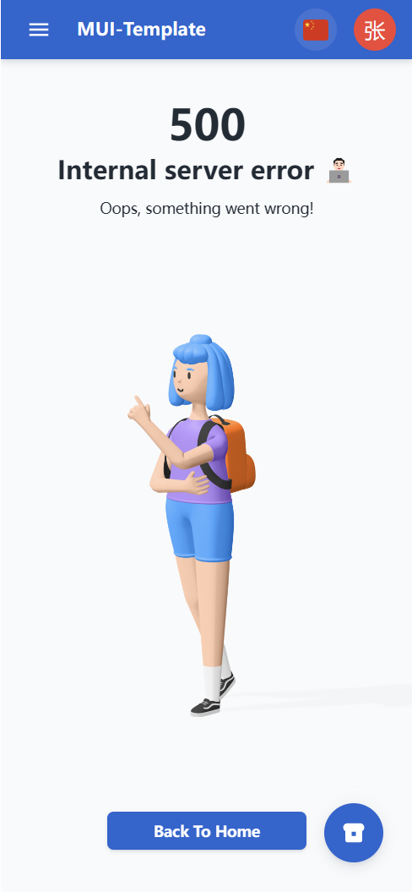

# MUI Dashboard Template
[DEMO](https://luoanb.github.io/mui-template/)




## Features[特征]
* React
* TypeScript
* @mui/material,@mui/icons-material,@mui/x-data-grid
* Mobile friendly layout (responsive)
* React Router
* Stylish, clean, responsive layout
* Authentication
* I18next
* Xlsx

## Quick Start[快速开始]

#### 1. Get the latest version

You can start by cloning the latest version of React Dashboard on your
local machine by running:

```shell
$ git clone https://github.com/luoanb/mui-template.git MyApp
$ cd MyApp
```

#### 2. Run `pnpm install`

This will install both run-time project dependencies and developer tools listed
in [package.json](../package.json) file.
```shell
pnpm install
```

#### 3. Run `pnpm dev`

This command will start the app with simultaneously with express server,
set up your database, start local server XAMPP, opensever, or other tool
to start database, connect to it in file 
```shell
pnpm dev
```
## Screenshots[截图]


|  |  |
| --- | --- |

## License[协议]
MIT and another MIT from RSK.